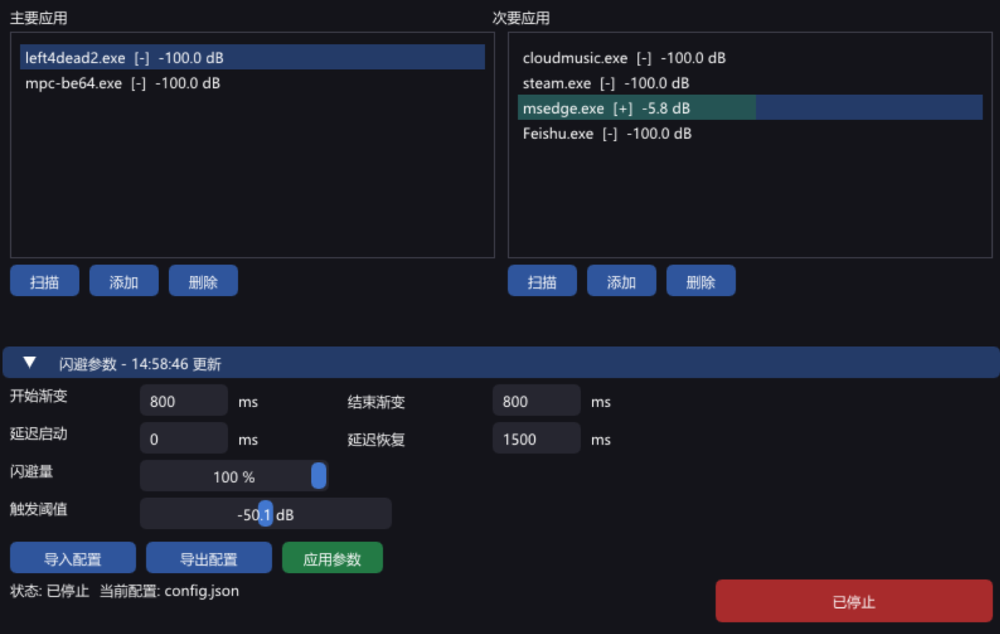

# OpenAudioDucking

> ⚠️ **重要提示**
> 
> 1. 此工具完全由 **AI 编写、测试、编译**，无任何人工修改代码。受限于 AI 编写代码的优化能力，**CPU 和内存占用会偏高**，性能感人，介意勿用。
> 2. 此工具是为满足个人需求而编写的，已达标，**不会再进行大的功能更新**。

---

Windows 音频闪避工具——当主应用播放音频时，自动降低次要应用的音量。



## 功能

- 🎚️ 主/次要应用双列表管理，VU 音量条实时显示
- 🔊 渐变闪避：Attack/Release 平滑过渡，延迟启动/恢复
- 📊 dB 阈值触发：主应用音量超过设定值才闪避
- 🔍 扫描弹窗：一键添加正在运行的应用
- 💾 JSON 配置导入/导出，自动保存恢复
- 📌 系统托盘：最小化/关闭到托盘，红绿边框运行指示灯
- 🚫 单实例保护：重复打开自动恢复已运行窗口

## 系统要求

- Windows 7 SP1 或更高（仅 64 位）
- DirectX 11 兼容显卡
- 无需额外安装任何运行时

## 下载

从 [Releases](../../releases) 页面下载最新 `OpenAudioDucking.zip`，解压后运行 `OpenAudioDucking.exe`。

## 构建

### 依赖

- CMake 3.20+
- MinGW-w64 (通过 [WinLibs](https://winlibs.com/) 或 [MSYS2](https://www.msys2.org/))
- 或 Visual Studio 2022

项目默认使用静态链接（`-static`），生成单文件 exe，无需额外 DLL。

### MinGW

```powershell
# Debug 构建（带调试符号，便于调试）
cmake -S . -B build -G "MinGW Makefiles" -DCMAKE_BUILD_TYPE=Debug
cmake --build build -j4

# Release 构建（优化 + 静态链接单文件）
cmake -S . -B build -G "MinGW Makefiles" -DCMAKE_BUILD_TYPE=Release
cmake --build build -j4
```

### MSVC

```powershell
# Debug 构建
cmake -S . -B build -G "Visual Studio 17 2022" -A x64
cmake --build build --config Debug

# Release 构建
cmake -S . -B build -G "Visual Studio 17 2022" -A x64
cmake --build build --config Release
```

### 单文件发布

Release 构建已默认生成静态链接单文件。发布版本直接复制即可：

```powershell
cmake --build build -j4 --config Release
Copy-Item -LiteralPath "build\OpenAudioDucking.exe" -Destination "release\"
```

### 目录结构

```
OpenAudioDucking/
├── CMakeLists.txt        # FetchContent 自动拉取 Dear ImGui
├── src/
│   ├── main.cpp          # GUI + Win32 + D3D11
│   └── AudioDucker.cpp   # Core Audio COM 引擎
├── include/
│   └── AudioDucker.h
├── resource/             # 图标资源
└── tests/                # 测试占位
```

## 技术栈

- **C++17** + **CMake**
- **Dear ImGui** (v1.92.8, FetchContent 自动拉取)
- **DirectX 11** (Windows 自带)
- **Windows Core Audio** (`IAudioSessionManager2`, `ISimpleAudioVolume`, `IAudioMeterInformation`)

## 许可

MIT License

